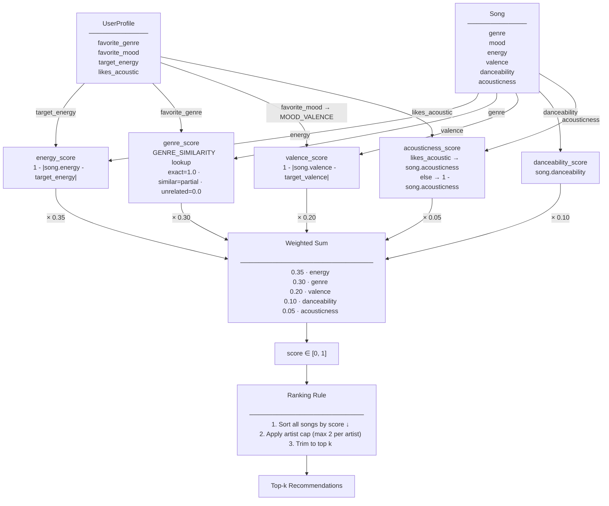

```mermaid
flowchart TD
    UP["UserProfile
    ─────────────
    favorite_genre
    favorite_mood
    target_energy
    likes_acoustic"]

    S["Song
    ─────────────
    genre
    mood
    energy
    valence
    danceability
    acousticness"]

    UP -->|target_energy| E["energy_score
    1 - |song.energy - target_energy|"]

    UP -->|favorite_genre| G["genre_score
    GENRE_SIMILARITY lookup
    exact=1.0 · similar=partial · unrelated=0.0"]

    UP -->|favorite_mood → MOOD_VALENCE| V["valence_score
    1 - |song.valence - target_valence|"]

    S -->|energy| E
    S -->|genre| G
    S -->|valence| V
    S -->|danceability| D["danceability_score
    song.danceability"]
    S -->|acousticness| A["acousticness_score
    likes_acoustic → song.acousticness
    else → 1 - song.acousticness"]
    UP -->|likes_acoustic| A

    E -->|"× 0.35"| W["Weighted Sum
    ─────────────────────────────
    0.35 · energy
    0.30 · genre
    0.20 · valence
    0.10 · danceability
    0.05 · acousticness"]

    G -->|"× 0.30"| W
    V -->|"× 0.20"| W
    D -->|"× 0.10"| W
    A -->|"× 0.05"| W

    W --> SCORE["score  ∈  [0, 1]"]

    SCORE --> R["Ranking Rule
    ─────────────────────────
    1. Sort all songs by score ↓
    2. Apply artist cap (max 2 per artist)
    3. Trim to top k"]

    R --> OUT["Top-k Recommendations"]
```
